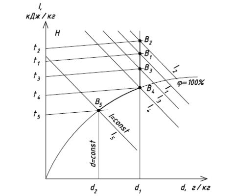

# id-diagram

<div align="center">
  <p align="center">
    <a href="https://t.me/hvac_ru">HVAC group on Telegram</a>
  </p>
</div>

## Install

```
$ yarn add id-diagram
```

## Documentation
```javascript
import { TDPoint } from 'id-diagram';

const pointB1 = new TDPoint({ t: 28, fi: 43 });
```

## Road Map

### Параметры произвольной точки на диаграмме

- [x] `pointB1.get('t')`
- [x] `pointB1.get('fi')`
- [x] `pointB1.getHumidity()` _Влагосодержание / Humidity, g/kg dry air_
- [x] `pointB1.getEnthalpy()` _Энтальпия / Enthalpy, kJ/kg_
- [x] `pointB1.getTR()` _Точка росы / Dew Point Temperature, C_
- [x] `pointB1.getWBT()` _Температура мокрого термометра / Wet Bulb Temperature, C_

> If `point.get('errors').length > 0` then this point is wrong. Check this.

### Вычисление термодинамических процессов.

- [x] HEATING // Изобарный нагрев / Isobaric heating; h= const;
```javascript
const pointB2 = pointB1.process({
  type: 'heating',
  finalParams: { t: 50 }
});
const finalFi = pointB2.get('fi');

console.log(finalFi);
// 37.592996573271044 // %

console.log(pointB2.processResult);
// { DELTA_H: 19.701903411072525,
//   DELTA_E: 75.81706462959397,
//   DELTA_FI: -5.407003426728956 }

// And also, we have access to parent point:
console.log(pointB2.parentPoint.get('t'));
// 28 // C
```
- [x] COOLING
```javascript
const pointB5 = pointB1.process({
  type: 'cooling',
  finalParams: { t: 20 }
});

console.log(pointB5.processResult);
// { DELTA_H: 3.048618541440435,
//   DELTA_E: -0.825783743099322,
//   DELTA_FI: 46.985959780055154 }

const pointB4 = pointB5.parentPoint; // Точка росы (начало конденсации)
```
- [ ] ADIABATIC (Should be tested) // e= const
```javascript
const point2a = pointB1.process({
  type: 'adiabatic',
  finalParams: { t: 22 }
});
const finalFi2a = point2a.get('fi');

console.log(finalFi2a);
// TODO: Should be tested.

console.log(point2a.processResult);
// TODO: Should be tested.

const point2b = pointB1.process({
  type: 'adiabatic',
  finalParams: { fi: 85 }
});

console.log(finalFi2b);
// TODO: Should be tested.

console.log(point2b.processResult);
// TODO: Should be tested.
```
- [ ] _Others_

_To be continued..._

## Commands
- `npm run clean` - Remove `lib/` directory
- `npm test` - Run tests with linting and coverage results.
- `npm test:only` - Run tests without linting or coverage.
- `npm test:watch` - You can even re-run tests on file changes!
- `npm test:prod` - Run tests with minified code.
- `npm run test:examples` - Test written examples on pure JS for better understanding module usage.
- `npm run lint` - Run ESlint with airbnb-config
- `npm run cover` - Get coverage report for your code.
- `npm run build` - Babel will transpile ES6 => ES5 and minify the code.
- `npm run prepublish` - Hook for npm. Do all the checks before publishing your module.

## License

MIT © Den Pol
